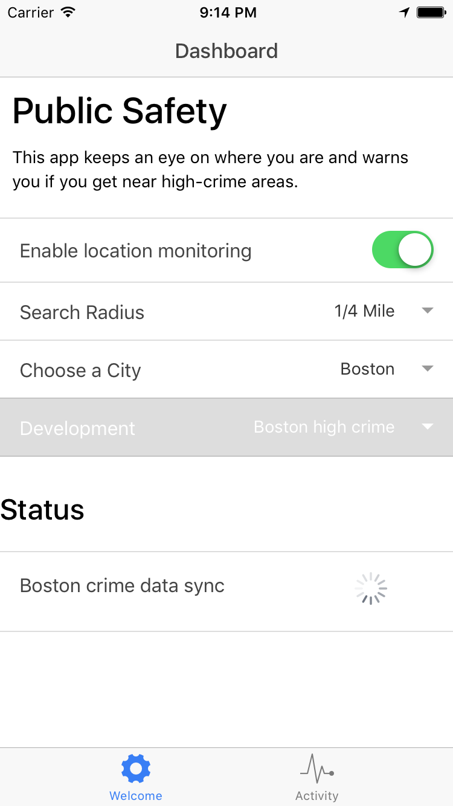

# Crionic

Crionic is a mobile app which will notify you if you wander into a high-crime location.

## Usage

Install the Ionic View app for Android or iOS. Then install app ID 0cfa2ce2.

Open the app. In the first setup page are some simple settings.

To use Crionic:

1. Enable location tracking
2. Wait for the data to sync the first time.
3. Close the app

Crionic will now watch where you go, and send an alert to your device if you wander into a location with a high amount of recent crime.

## Development

You can run this app in Xcode, or a web browsesr, or your own device. Just clone this project, then run:

1. `npm install`
2. `npm run bower`
3. `npm run xcode` or `npm run serve`

This will run the Ionic app in your Xcode, or in your browser!

## License

Apache 2.0
